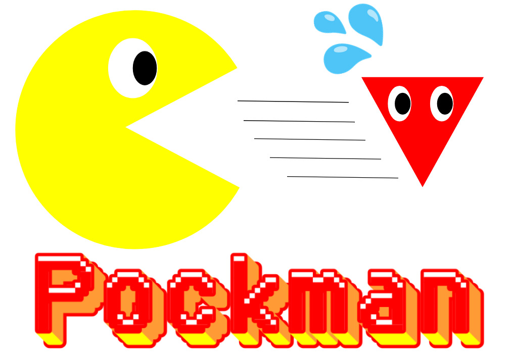

# PockMan 🔎



## Overview 🎯

PockMan is an open-source tool designed to identify potential ligand binding pockets in protein structures. It uses a voxel-based grid projection system to analyze protein surface features and detect potential binding sites.

## Features 🔬

- **Protein Grid Projection**: Maps protein atoms onto a 3D grid.
- **Pocket Detection**: Identifies cavities using axial and optional diagonal searches.
- **Residue Analysis**: Finds residues near detected binding sites.
- **PDB File Support**: Accepts local PDB files or downloads structures from RCSB PDB.
- **Output Visualization**: Saves pocket sites in a PDB file for visualization.

## Installation 📦

### Prerequisites 🐍

Ensure you have Python 3 installed. You also need the following dependencies:

```bash
pip install numpy biopython tqdm requests setuptools
```

### Installing the Package ⚙️

#### **Standard Installation (Recommended for Users) 💻**
1. Clone the repository:
   ```bash
   git clone https://github.com/rsk170/PockMan.git
   cd PockMan
   ```
2. Build the package and install it:
   ```bash
   python3 setup.py sdist
   pip install dist/PockMan-1.0.tar.gz
   ```

#### **Development Mode (Editable Installation) 🛠️**
If you're modifying the code and want changes to take effect immediately:
```bash
pip install -e .
```

### Upgrading the Package 🔄

To update to the latest version after making changes:
```bash
pip install --upgrade dist/PockMan-1.0.tar.gz
```

### Uninstalling the Package ❌

If you need to remove the package:
```bash
pip uninstall PockMan
```

## Commands ⚙️
```bash
usage: pockman [-h] [--grid_size GRID_SIZE] [--border BORDER] [--diagonals] pdb_input

PockMan is a Python script built to predict ligand binding sites of proteins from their .pdb files.

positional arguments:
  pdb_input             Path to the input PDB file or a valid PDB ID

optional arguments:
  -h, --help            Show this help message and exit
  --grid_size GRID_SIZE
                        Resolution in Angstroms (default: 1.0)
  --border BORDER       Extra space around the protein (default: 5.0)
  --diagonals           Include diagonal pocket detection for a more comprehensive search.
```

## Usage 🖥️

### Command Line Execution
Run the program from the terminal with a local PDB file:
```bash
pockman 1a28.pdb --grid_size 1.0 --border 5.0
```

To use a PDB ID and download it automatically:
```bash
pockman 1a28 --grid_size 1.0 --border 5.0
```

To enable diagonal pocket detection, add the `--diagonals` flag:
```bash
pockman 1a28.pdb --grid_size 1.0 --border 5.0 --diagonals
```

### Interactive Mode 📝
If no command-line arguments are provided, the script will prompt for input:
```bash
$ pockman
Enter the path to the input PDB file (or a PDB ID to use): myprotein.pdb
Enter grid size in Angstroms (default: 1.0): 1.0
Enter border size in Angstroms (default: 5.0): 5.0
Would you like to include diagonal pocket detection? (yes/no): yes
```

## Output Files 📂📊
- **pockets.pdb**: PDB file marking identified binding pockets.
- **binding_site.txt**: List of binding sites.

## Example Output 💡
```
Protein grid shape: (100, 100, 100)
Pocket atoms saved in pockets.pdb
Found 12 residues near binding pockets.
```

## Contributors 👥
- Your Name

## Acknowledgments 🎖️
This tool uses **Biopython** for PDB processing, **NumPy** for grid computations, and **tqdm** for progress bars.